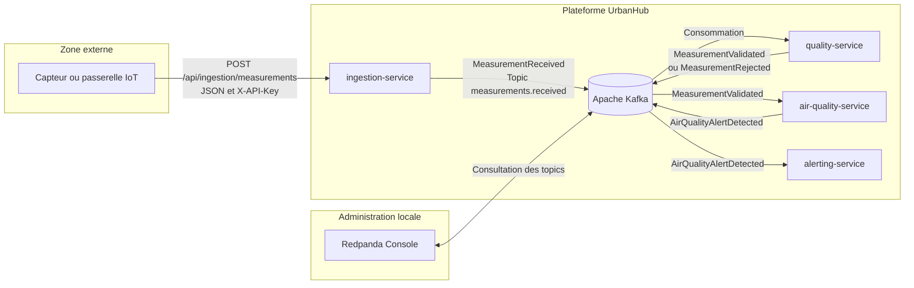
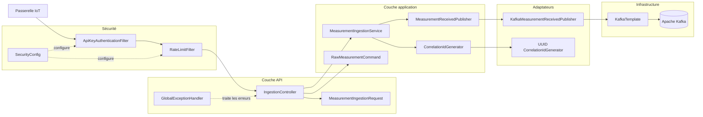
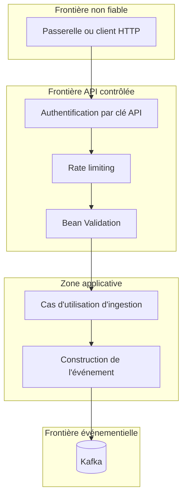

# Diagramme d'architecture UrbanHub

## Architecture événementielle

Le diagramme suivant présente la place de `ingestion-service` dans la chaîne UrbanHub.

## Architecture interne d'ingestion-service

## Frontières de confiance

## Légende

| Élément | Signification |
|---|---|
| Rectangle | Processus ou composant applicatif |
| Cylindre | Infrastructure de stockage ou bus d'événements |
| Sous-graphe | Couche, zone ou frontière de confiance |
| Flèche pleine | Flux de données ou appel |
| Flèche pointillée | Relation de configuration ou de traitement transversal |

## Principes représentés

- le client est considéré comme non fiable avant authentification et validation ;
- les filtres de sécurité s'exécutent avant le contrôleur ;
- le contrôleur traduit HTTP vers une commande applicative ;
- le service applicatif dépend de ports et non de Kafka directement ;
- l'adaptateur Kafka implémente le port de publication ;
- les microservices en aval consomment des contrats JSON versionnés ;
- Redpanda Console reste un outil d'administration limité à l'environnement local.
