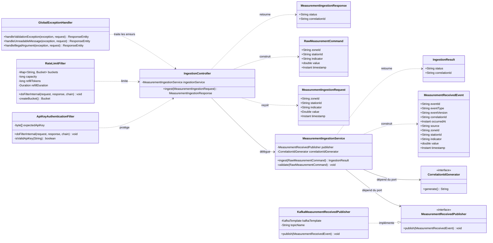

# Diagramme de classes du service d'ingestion

## Vue principale

Le diagramme présente les classes centrales du flux d'ingestion, de la requête HTTP jusqu'à la publication Kafka.

## Responsabilités

### `IngestionController`

Le contrôleur constitue l'adaptateur HTTP. Le contrôleur reçoit le DTO REST, construit une commande applicative et retourne une réponse HTTP.

### `MeasurementIngestionRequest`

Le record porte les données externes et les contraintes Bean Validation. Le record protège la frontière HTTP contre les champs absents, les formats non autorisés et les valeurs hors limites.

### `MeasurementIngestionService`

Le service orchestre le cas d'utilisation. Le service vérifie les invariants, génère les identifiants, construit l'événement et demande sa publication.

### `MeasurementReceivedPublisher`

L'interface constitue le port de sortie de la couche application. La couche application ne dépend pas directement de Kafka.

### `KafkaMeasurementReceivedPublisher`

L'adaptateur implémente le port de sortie avec `KafkaTemplate`. L'adaptateur utilise la zone comme clé Kafka et publie dans le topic configuré.

### `MeasurementReceivedEvent`

Le record représente le contrat événementiel JSON. Le contrat contient une version explicite et un identifiant de corrélation.

### Filtres de sécurité

`ApiKeyAuthenticationFilter` authentifie la passerelle. `RateLimitFilter` contrôle le nombre de requêtes par identité authentifiée.

### `GlobalExceptionHandler`

Le gestionnaire transforme les exceptions attendues en réponses d'erreur homogènes, sans exposer de détails techniques internes.

## Principes de conception

- responsabilité unique par composant ;
- dépendance de la couche application vers des interfaces ;
- séparation entre contrats REST et contrats Kafka ;
- validation à la frontière et validation métier défensive ;
- sécurité transversale avant l'exécution du contrôleur ;
- objets immuables représentés par des records Java.
