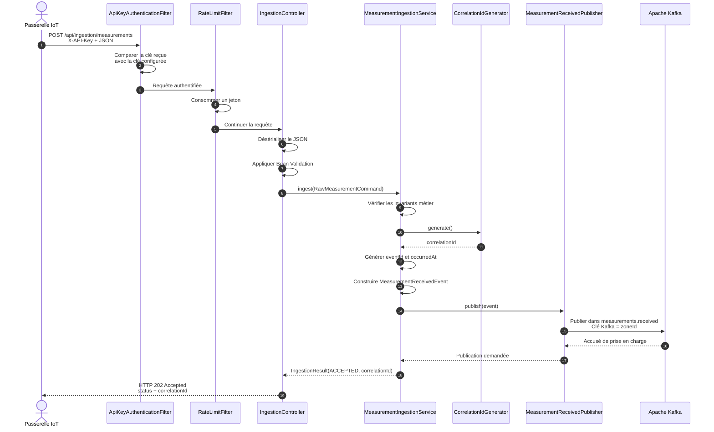
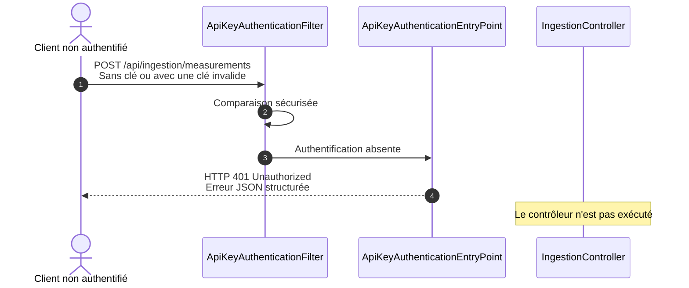
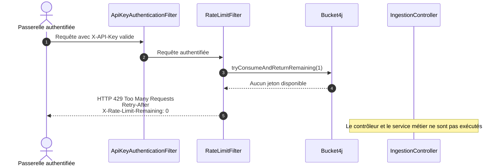
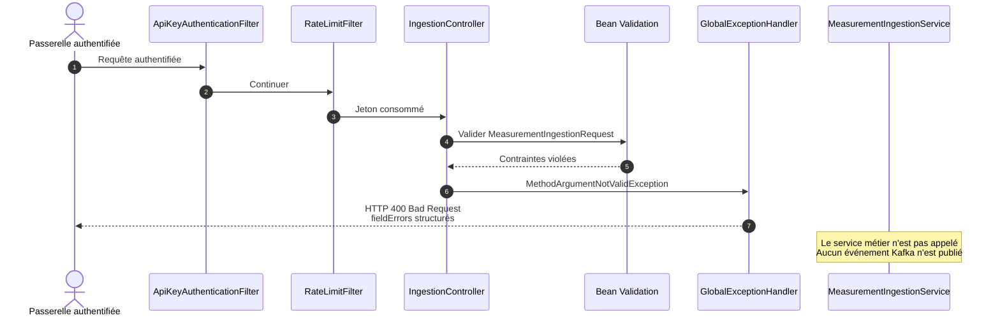
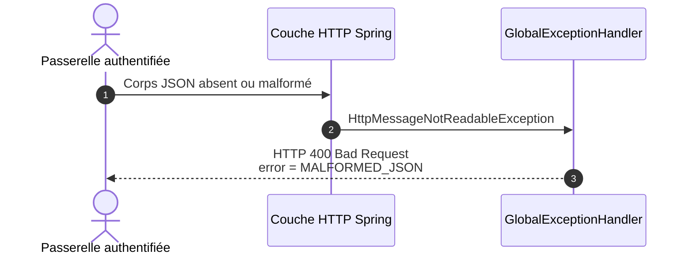

# Diagramme de séquence du flux d'ingestion

## Flux nominal

Le diagramme suivant décrit le traitement complet d'une mesure valide, depuis la passerelle IoT jusqu'à la publication Kafka.

## Rejet d'une requête non authentifiée

## Rejet d'une requête dépassant le quota

## Rejet d'une requête invalide

## Cas d'erreur JSON

## Données de corrélation

Deux identifiants assurent la traçabilité :

| Identifiant | Rôle |
|---|---|
| `eventId` | Identifie de manière unique l'événement publié |
| `correlationId` | Suit une même mesure dans l'ensemble de la chaîne UrbanHub |

Le `correlationId` est retourné au client dans la réponse HTTP 202 et inclus dans l'événement Kafka.

## Codes de réponse du flux

| Code HTTP | Situation | Publication Kafka |
|---:|---|---|
| `202` | Clé valide, quota disponible et mesure conforme | Oui |
| `400` | JSON invalide ou contraintes non respectées | Non |
| `401` | Clé API absente ou invalide | Non |
| `429` | Quota épuisé | Non |
| `500` | Erreur interne inattendue | Non garantie |

## Garanties du traitement

- une requête non authentifiée n'atteint pas le contrôleur ;
- une requête dépassant le quota n'atteint pas le service métier ;
- une mesure invalide ne produit aucun événement ;
- une mesure acceptée reçoit un identifiant de corrélation ;
- le contrat événementiel est explicite et versionné ;
- la clé Kafka `zoneId` favorise l'ordre relatif des événements par zone.
