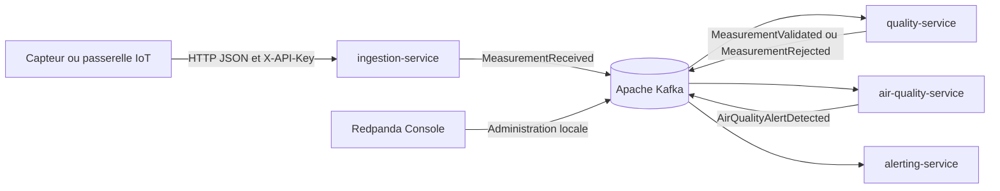
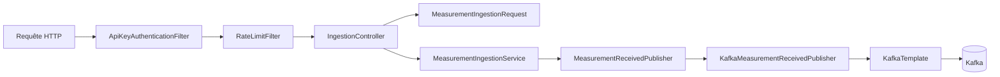
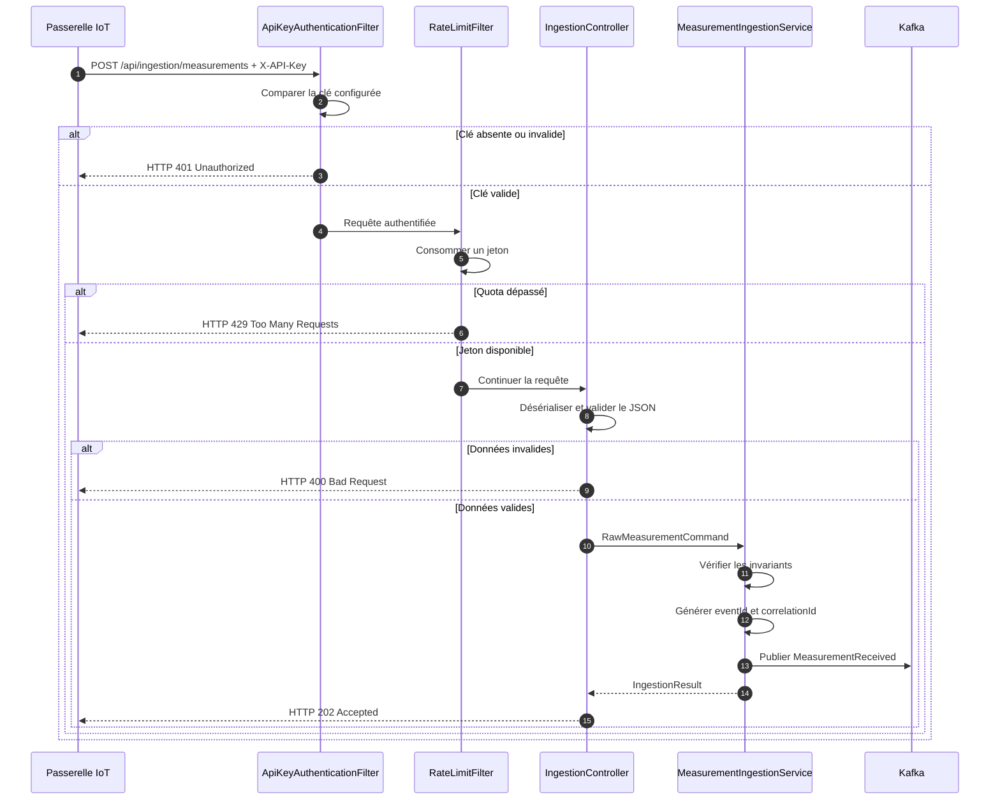

# Architecture du service d'ingestion

## Contexte

UrbanHub est une plateforme événementielle de ville intelligente. Des passerelles IoT transmettent des mesures environnementales qui sont validées, analysées et transformées en alertes par plusieurs microservices.

`ingestion-service` constitue le point d'entrée de cette chaîne. Le service protège l'accès HTTP, contrôle les données reçues et publie un événement JSON dans Apache Kafka.

## Vue d'ensemble UrbanHub



## Responsabilités du service

`ingestion-service` prend en charge :

1. l'exposition de la route REST d'ingestion ;
2. l'authentification de la passerelle par clé API ;
3. la limitation du débit avec un token bucket ;
4. la validation syntaxique et métier de la mesure ;
5. la génération de `eventId` et `correlationId` ;
6. la construction de `MeasurementReceivedEvent` ;
7. la publication JSON dans le topic `measurements.received` ;
8. l'exposition des endpoints de santé.

Le service ne calcule pas l'indice de qualité de l'air et ne produit pas de notification. Ces responsabilités appartiennent aux services en aval.

## Architecture interne



## Découpage par couches

### Couche API

Package :

```text
com.urbanhub.ingestion.api
```

Responsabilités :

- exposer les routes HTTP ;
- désérialiser le JSON ;
- appliquer Bean Validation ;
- traduire la requête en commande applicative ;
- retourner une réponse HTTP structurée ;
- standardiser les erreurs.

Classes représentatives :

- `IngestionController` ;
- `MeasurementIngestionRequest` ;
- `MeasurementIngestionResponse` ;
- `GlobalExceptionHandler` ;
- `ApiErrorResponse`.

### Couche application

Package :

```text
com.urbanhub.ingestion.application
```

Responsabilités :

- orchestrer le cas d'utilisation d'ingestion ;
- appliquer les invariants métier défensifs ;
- générer les identifiants ;
- construire l'événement ;
- appeler le port de publication.

Classes et interfaces représentatives :

- `MeasurementIngestionService` ;
- `RawMeasurementCommand` ;
- `MeasurementReceivedPublisher` ;
- `CorrelationIdGenerator` ;
- `IngestionResult`.

### Couche domaine

Package :

```text
com.urbanhub.ingestion.domain
```

La couche domaine contient les concepts métier indépendants de Spring, HTTP et Kafka. Cette séparation réduit le couplage et facilite les tests unitaires.

### Couche événementielle

Package :

```text
com.urbanhub.ingestion.events
```

Le record `MeasurementReceivedEvent` représente le contrat JSON publié dans Kafka.

Le contrat contient notamment :

- un identifiant unique ;
- un type et une version d'événement ;
- un identifiant de corrélation ;
- une date d'occurrence ;
- une source ;
- les données de mesure.

### Couche messaging

Package :

```text
com.urbanhub.ingestion.messaging
```

L'adaptateur Kafka implémente le port applicatif `MeasurementReceivedPublisher`. Le service applicatif ne dépend donc pas directement de `KafkaTemplate`.

### Couche sécurité

Package :

```text
com.urbanhub.ingestion.security
```

Responsabilités :

- extraire et comparer la clé API ;
- créer le contexte d'authentification ;
- imposer une politique stateless ;
- appliquer le refus par défaut ;
- limiter le débit par identité authentifiée ;
- produire une réponse HTTP 401 ou 429 structurée.

## Flux d'une mesure



## Décisions techniques

### Architecture événementielle

Kafka découple l'ingestion des traitements en aval. L'API peut accepter une mesure sans attendre la validation qualité ou le calcul d'une alerte.

### Port et adaptateur

`MeasurementIngestionService` dépend d'une interface de publication. Cette inversion de dépendance :

- limite le couplage à Kafka ;
- simplifie les tests avec un mock ;
- permet de remplacer l'adaptateur technique sans modifier le cas d'utilisation.

### Contrat JSON indépendant des packages Java

Le serializer Kafka ne publie pas d'information de type Java dans les headers. Les services échangent un contrat JSON versionné plutôt qu'un nom de classe interne.

Ce choix évite le couplage entre :

```text
com.urbanhub.ingestion.events.MeasurementReceivedEvent
```

et la classe locale du consommateur.

### Clé Kafka

La publication utilise `zoneId` comme clé Kafka. Les événements d'une même zone sont ainsi orientés de manière cohérente vers une partition, ce qui facilite le maintien de l'ordre relatif par zone.

### Validation à deux niveaux

Bean Validation protège la frontière HTTP. Une validation métier défensive reste présente dans la couche application afin de protéger le cas d'utilisation si une autre interface l'appelle ultérieurement.

### Sécurité stateless

Le service n'utilise pas de session HTTP. Chaque requête apporte sa preuve d'authentification et le serveur applique une politique de refus par défaut.

### Rate limiting en mémoire

Bucket4j limite les appels dans l'instance courante. Cette solution est simple et adaptée au déploiement mono-instance de démonstration. Une architecture multi-instance nécessiterait Redis ou une API Gateway.

## Déploiement conteneurisé

L'image Docker utilise un build multi-stage :

1. Maven compile et package l'application ;
2. une image Java Runtime minimale exécute uniquement le JAR final.

Le runtime :

- utilise Java 25 ;
- exécute le processus avec l'utilisateur non-root `urbanhub` ;
- expose le port 8082 ;
- limite l'utilisation mémoire de la JVM selon les ressources du conteneur.

## Frontières de confiance

### Client vers API

La passerelle IoT est considérée comme non fiable avant authentification et validation.

Contrôles :

- clé API ;
- rate limiting ;
- limites de taille et de format ;
- réponses d'erreur contrôlées.

### API vers Kafka

Le flux transporte des événements métier JSON. Le contrat est versionné avec `eventVersion`.

Évolution recommandée : TLS, SASL et ACL par microservice.

### Opérateur vers Redpanda Console

L'interface d'administration est limitée à localhost dans l'environnement de démonstration.

## Qualités architecturales

### Maintenabilité

- responsabilités séparées ;
- dépendances dirigées vers des abstractions ;
- contrats documentés ;
- tests par couche ;
- règles de qualité automatisées.

### Testabilité

Le port de publication et le générateur de corrélation peuvent être mockés. Les tests HTTP utilisent MockMvc sans broker réel.

### Évolutivité

L'architecture événementielle permet d'ajouter un consommateur sans modifier l'API d'ingestion. Les événements disposent d'un champ de version.

### Observabilité

`eventId` identifie un événement unique. `correlationId` permet de suivre un traitement distribué. Actuator expose la santé de l'instance.

## Limites et trajectoire d'évolution

### Limites actuelles

- clé API partagée ;
- quotas conservés en mémoire ;
- Kafka local sans politique complète TLS/SASL/ACL ;
- observabilité limitée aux logs et healthchecks ;
- absence de DLQ dans le périmètre actuel.

### Évolutions recommandées

1. utiliser une identité distincte par passerelle ;
2. externaliser le rate limiting ;
3. sécuriser Kafka avec TLS, SASL et ACL ;
4. ajouter retry, backoff et DLQ ;
5. centraliser logs, métriques et traces ;
6. persister et superviser les contrats événementiels.
