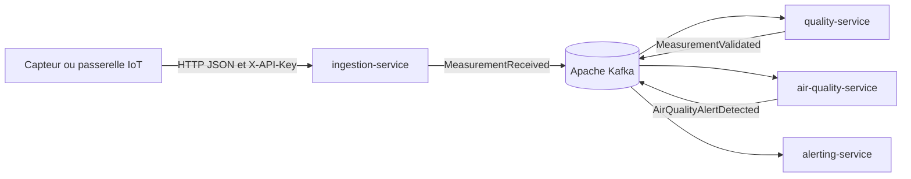

# Documentation technique UrbanHub

## Service documenté

Cette documentation présente le microservice `ingestion-service` de la plateforme UrbanHub.

Le service constitue le point d'entrée des mesures IoT. Le service reçoit des données environnementales, applique les contrôles de sécurité et de validation, puis publie les événements acceptés dans Apache Kafka.

## Fonctions principales

`ingestion-service` assure les responsabilités suivantes :

1. exposer une API REST d'ingestion ;
2. authentifier la passerelle avec le header `X-API-Key` ;
3. limiter la fréquence des requêtes ;
4. valider les données entrantes ;
5. générer `eventId` et `correlationId` ;
6. publier l'événement `MeasurementReceived` ;
7. exposer un endpoint de santé pour l'exploitation.

## Parcours de lecture

La documentation suit l'approche Diátaxis afin de répondre aux différents besoins des lecteurs.

### Tutoriel

Pour découvrir la solution à travers un premier parcours guidé :

- [Premier démarrage et première mesure](tutoriel.md)

### Guides pratiques

Pour réaliser une opération précise :

- [Exploiter le service](exploitation.md)
- [Comprendre et exécuter le pipeline](pipeline.md)
- [Résoudre les incidents courants](depannage.md)
- [Maintenir et faire évoluer le service](maintenance-evolution.md)

### Référence

Pour consulter les contrats, paramètres et comportements attendus :

- [Référence API](api.md)
- [Référence technique](reference.md)
- `../openapi.json`

### Explications

Pour comprendre les choix de conception :

- [Architecture](architecture.md)
- [Sécurité](securite.md)
- `../diagrammes/architecture.md`
- `../diagrammes/classes.md`
- `../diagrammes/sequence-ingestion.md`

## Vue d'ensemble du flux



## Démarrage rapide

### Prérequis

- Java 25 ;
- Maven 3.9 ou compatible ;
- Docker ;
- Docker Compose V2.

### Vérification du code

Depuis la racine du dépôt :

```bash
mvn   --file services/ingestion-service/pom.xml   clean verify
```

### Démarrage local

Sous PowerShell :

```powershell
$env:INGESTION_API_KEY = "replace-with-a-local-key"
docker compose up --build -d kafka ingestion-service
```

### Vérification de la disponibilité

```powershell
Invoke-RestMethod `
  http://localhost:8082/actuator/health/readiness
```

Réponse attendue :

```json
{
  "status": "UP"
}
```

## Qualité et sécurité vérifiées

La solution documentée dispose des contrôles suivants :

- tests JUnit automatisés ;
- tests REST et de validation ;
- tests d'authentification et de rate limiting ;
- test non fonctionnel du temps de réponse ;
- couverture JaCoCo avec gates à 60 % ;
- Checkstyle bloquant ;
- SpotBugs et Find Security Bugs ;
- Gitleaks bloquant ;
- analyse des dépendances avec Trivy ;
- SBOM CycloneDX ;
- image Docker multi-stage ;
- utilisateur de runtime non-root ;
- déploiement local et smoke tests.

## Pipeline CI/CD

Le pipeline suit une séquence bloquante :

```text
install → test → quality → security → build → deploy
```

Une erreur dans un job empêche les jobs suivants de démarrer.

## Documentation collaborative

Les pages sont écrites en Markdown et destinées à un portail MkDocs Material.

Pour contribuer :

1. créer une branche dédiée ;
2. modifier le code et la documentation associée ;
3. vérifier les liens et les commandes ;
4. lancer `mkdocs build --strict` ;
5. soumettre la modification à une revue ;
6. mettre à jour `CHANGELOG.md` lorsque le comportement change.

## Limites connues

- la clé API est partagée dans le périmètre actuel ;
- le rate limiting est conservé en mémoire ;
- Kafka utilise une configuration locale de démonstration ;
- SpotBugs reste en mode audit pendant la qualification initiale ;
- les vulnérabilités Trivy doivent être priorisées et remédiées progressivement.

## Évolutions prioritaires

- attribuer une identité distincte à chaque passerelle IoT ;
- externaliser le stockage des quotas ;
- activer TLS, SASL et des ACL Kafka ;
- ajouter une stratégie de retry et une DLQ ;
- centraliser les métriques et les logs ;
- automatiser les mises à jour de dépendances.
