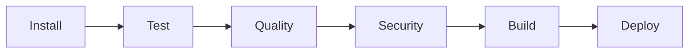

# Pipeline CI/CD

## Objectif

Le pipeline automatise l'installation, les tests, la qualité, la sécurité, la création de l'image Docker et le déploiement local de `ingestion-service`.

## Chaîne d'exécution



Chaque job dépend du précédent. Une erreur interrompt la chaîne et protège la branche principale.

## Déclencheurs

Le workflow est exécuté :

- lors d'un push sur `main` affectant le service ou le workflow ;
- lors d'une pull request vers `main` ;
- manuellement avec `workflow_dispatch`.

## Job install

Responsabilités :

- récupérer le dépôt ;
- installer Java 25 Temurin ;
- restaurer le cache Maven ;
- afficher les versions Java et Maven ;
- résoudre les dépendances avec `dependency:go-offline`.

## Job test

Le job exécute :

```bash
mvn --batch-mode --no-transfer-progress clean verify
```

La commande couvre :

- compilation ;
- tests unitaires ;
- tests MockMvc ;
- tests de validation ;
- tests d'authentification ;
- test du rate limiting ;
- test non fonctionnel du temps de réponse ;
- rapport JaCoCo ;
- gates de couverture ;
- packaging du JAR.

### Couverture

```text
Couverture des lignes >= 60 %
Couverture des branches >= 60 %
```

Les rapports Surefire et JaCoCo sont publiés dans l'artefact `ingestion-test-reports`.

## Job quality

### Checkstyle

Checkstyle contrôle les conventions Java et bloque le job en cas de violation.

### SpotBugs et Find Security Bugs

SpotBugs analyse le bytecode. Find Security Bugs ajoute des détecteurs orientés sécurité.

Résultat initial :

```text
1 finding général
0 finding SECURITY
```

SpotBugs reste temporairement en mode audit pendant la qualification du finding général. Les rapports sont publiés dans `ingestion-quality-reports`.

## Job security

### Gitleaks

Gitleaks analyse l'historique Git complet avec les secrets masqués dans les sorties.

```text
Secret détecté -> job en échec
```

Une exclusion n'est autorisée qu'après qualification d'un faux positif et doit rester limitée au fingerprint exact.

### Trivy filesystem

Trivy analyse les dépendances Maven et produit :

- un rapport JSON ;
- un rapport SARIF ;
- une SBOM CycloneDX.

La baseline Trivy reste temporairement non bloquante pendant la qualification des vulnérabilités existantes. L'absence des rapports attendus bloque néanmoins le job.

Les résultats sont publiés dans `ingestion-security-reports`.

## Job build

Le job construit une image Docker versionnée :

```text
urbanhub-ingestion:<SHA-Git>
```

Propriétés :

- build multi-stage ;
- compilation Maven dans le premier stage ;
- runtime Java 25 dans le second stage ;
- copie du seul JAR nécessaire ;
- exécution avec l'utilisateur non-root `urbanhub` ;
- port applicatif 8082.

Les métadonnées de l'image sont publiées dans `ingestion-build-evidence`.

## Job deploy

Le job réalise un déploiement local éphémère :

1. générer une clé API temporaire et masquée ;
2. démarrer Kafka et `ingestion-service` avec Docker Compose ;
3. attendre la readiness ;
4. vérifier qu'une requête sans clé retourne HTTP 401 ;
5. vérifier qu'une requête authentifiée retourne HTTP 202 ;
6. collecter l'état et les logs ;
7. arrêter et nettoyer l'environnement.

Les preuves sont publiées dans `ingestion-deployment-evidence`.

## Artefacts

| Artefact | Contenu |
|---|---|
| `ingestion-test-reports` | Surefire et JaCoCo |
| `ingestion-quality-reports` | Checkstyle et SpotBugs |
| `ingestion-security-reports` | Gitleaks, Trivy et SBOM |
| `ingestion-build-evidence` | Métadonnées de l'image Docker |
| `ingestion-deployment-evidence` | Readiness, smoke tests et logs |

## Gates bloquantes

Le pipeline échoue en cas de :

- dépendance Maven non résolue ;
- erreur de compilation ;
- test en échec ;
- violation Checkstyle ;
- couverture insuffisante ;
- secret détecté ;
- image Docker non construite ;
- readiness indisponible ;
- smoke test en échec.

## Reproductibilité locale

```bash
mvn --file services/ingestion-service/pom.xml clean verify

docker build   --tag urbanhub-ingestion:local   services/ingestion-service

export INGESTION_API_KEY="replace-with-a-local-key"
docker compose up --build -d kafka ingestion-service
```

Sous PowerShell :

```powershell
$env:INGESTION_API_KEY = "replace-with-a-local-key"
docker compose up --build -d kafka ingestion-service
```

## Résultat validé

Le pipeline complet a été exécuté avec succès de `install` à `deploy`. Les tests, les gates de couverture, les contrôles qualité, les analyses de sécurité, le build Docker et les smoke tests ont abouti.
